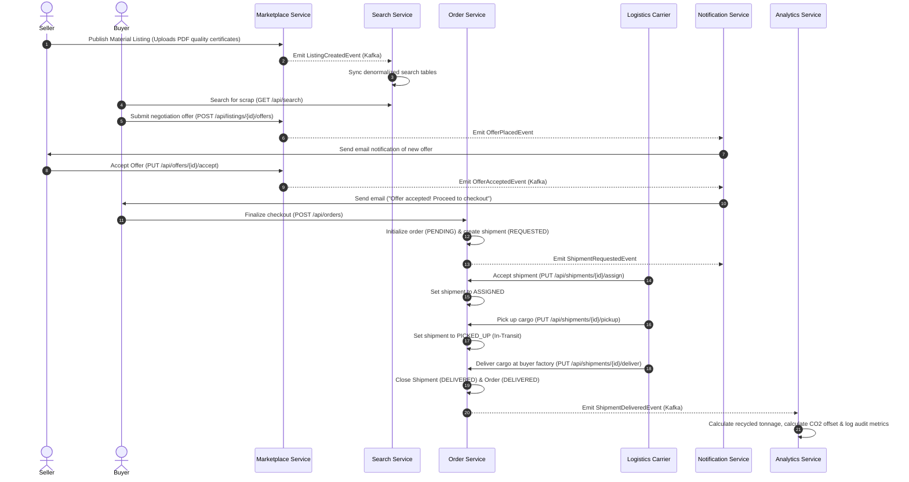

# 🌱 EcoExchange (formerly IndustryConnect)

[](https://openjdk.org/)
[](https://spring.io/projects/spring-boot)
[](https://spring.io/projects/spring-cloud)
[](https://kafka.apache.org/)
[](https://react.dev/)
[](https://vite.dev/)

EcoExchange is a cloud-native, B2B digital marketplace platform designed to bridge the gap between waste-producing industrial plants and recycling or manufacturing enterprises that consume waste as production raw materials. By facilitating transparent trade, tracking shipping logistics, and supplying detailed metrics on recycled waste tonnage and carbon dioxide emissions offset, EcoExchange powers the global transition toward a sustainable, circular economy.

---

## 🏢 The Industrial Waste Dilemma (The Problem)

Modern manufacturing processes generate millions of tons of byproducts and waste materials annually, including:
*   **Steel Scrap & Metal Offcuts**
*   **Fly Ash** (from heavy combustion and power generation)
*   **Plastic Scrap & Industrial Polymers**
*   **Textile Waste & Fabric Offcuts**
*   **Wood Waste, Shavings & Sawdust**
*   **Glass Waste & Cullet**

### Past Inefficiencies & Pain Points
1.  **High Disposal Costs & Landfill Pressures**: Waste producers frequently pay steep hauling and disposal fees to get rid of scrap material, despite these materials retaining residual value.
2.  **Virgin Sourcing Friction**: Recyclers, cement makers, and packagers source premium virgin raw inputs at high costs when recycled industrial byproducts would suffice.
3.  **Lack of Trust & Material Quality Verification**: Industrial buyers require proof of chemical compositions or physical properties. Without verified quality certificates and seller onboarding moderation, transaction trust is nonexistent.
4.  **Logistics Coordination Overhead**: Arranging transportation for heavy industrial-grade materials involves complex logistics, tracking carriers, and checking delivery statuses, which are historically manual and fragmented.
5.  **Lack of Sustainability Metrics**: Corporations have had no centralized way to calculate and report their contributions to landfill diversion and carbon footprint reduction (CO2 saved).

---

## 💡 The EcoExchange Solution

EcoExchange solves these industry-wide challenges through a secure, distributed B2B platform:
*   **Onboarded Organizations**: Only verified companies audited by Platform Administrators can post listings and transact.
*   **Listing Quality Assurances**: Sellers upload lab assay certificates and images alongside waste material listings.
*   **Bidding & Negotiation Engine**: Structured offer-negotiation stages allowing custom buy bids (custom quantity and unit price propositions).
*   **End-to-End Logistics Tracking**: Tracks shipment lifecycles from creation to assignment, cargo pickup, transit, and delivery confirmation.
*   **Environmental Impact Analytics**: Automatically calculates total waste reused in tons and matches it against category-specific coefficients to record real-time CO2 savings.
*   **Enterprise Resilience & Security**: Implements idempotent requests via `X-Idempotency-Key` and resilient event streams with automatic retry topics and Dead Letter Queues (DLQ).

---

## 🚀 Key Platform Features

### 1. Sellers (Waste Producers)
*   **Register Organization**: Provide GST numbers and business details to request admin authorization.
*   **Create Listings**: Post waste materials, categories, locations, descriptions, images, and quality certificates.
*   **Manage Inventory**: Track remaining quantity and monitor listing status (active, pending, completed).
*   **Negotiate & Accept Bids**: Accept or reject buyer-proposed pricing and quantity bids.

### 2. Buyers (Waste Consumers)
*   **Optimized Marketplace Search**: Search, autocomplete, and filter listings by category, price, and location in `<500ms`.
*   **Analyze Listings**: Review listing details, view images, and download verified quality certificates.
*   **Submit Offers (Bids)**: Submit custom quantity and pricing bids to negotiate terms.
*   **Track Orders**: Check payment status, order tracking history, and live delivery updates.

### 3. Logistics Partners
*   **View Shipments**: See shipments assigned to their freight service.
*   **Lifecycle Progression**: Transition shipment states: `REQUESTED` ➔ `ASSIGNED` ➔ `PICKED_UP` ➔ `DELIVERED`.
*   **Proof of Delivery**: Closing order runs automatically upon cargo delivery confirmation.

### 4. Platform Administrators
*   **Verify Organizations**: Audit organization profiles and GST numbers to control platform onboarding.
*   **Listing Moderation**: Moderate listings for safety compliance and suspend bad actors.
*   **Audit Viewer**: Review global system operations and check full platform transaction details.

---

## 🏗️ System Architecture & Service Boundaries

EcoExchange is designed as an event-driven, cloud-native microservice architecture using **Spring Boot**, **Spring Cloud**, and **Apache Kafka**.

```
                           +------------------------+
                           |   Vite/React Frontend  |
                           +-----------+------------+
                                       |
                                       | HTTP / REST
                                       v
                           +-----------+------------+
                           |  Spring Cloud Gateway  | (Port: 8080)
                           +-----------+------------+
                                       |
          +----------------------------+----------------------------+
          | (Route Routing)            | (Discovery Registry)       | (Centralized Properties)
          v                            v                            v
+---------+----------+       +---------+----------+       +---------+----------+
|  Discovery Service |       |   Config Service   |       |   Identity Service |
| (Eureka, Port 8761)|       | (Server, Port 8888)|       | (Auth, Port 8081)  |
+--------------------+       +--------------------+       +---------+----------+
                                                                    |
+-------------------------------------------------------------------+
|
|   +---------------------+       +---------------------+       +---------------------+
|-->| Marketplace Service |-->    |    Order Service    |-->    |   Search Service    |
|   |  (Core, Port 8082)  |   |   | (Fulfill, Port 8083)|   |   | (Search, Port 8084) |
|   +----------+----------+   |   +----------+----------+   |   +----------+----------+
|              |              |              |              |              ^
|              | Kafka Events |              | Kafka Events |              | Consumes Search Events
|              v              |              v              |              |
|   +----------------------------------------------------------------------+----------+
|   |                                Apache Kafka Broker                              |
|   +------------------+-----------------------------+-----------------------------+
|                      |                             |
|                      | Consumes Notifications      | Consumes Stats & Audits
|                      v                             v
|           +----------+----------+       +----------+----------+
|           |Notification Service |       |  Analytics Service  |
|           | (Alerts, Port 8085) |       | (Metrics, Port 8086)|
|           +---------------------+       +---------------------+
|
+-------------------------------------------------------------------------------------+
```

### Microservices Catalog

| Service | Port | Database | Primary Responsibility & Tech Stack |
| :--- | :--- | :--- | :--- |
| **Discovery Service** | `8761` | *None* | Eureka Service Discovery Registry. Coordinates dynamic microservice routing. |
| **Config Service** | `8888` | *None* | Centralized Spring Cloud Config Server. Uses `native` profile to read YAML property files from the local `./config-repo` directory. |
| **API Gateway** | `8080` | *None* | Spring Cloud Gateway (Webflux-based). Validates JWT tokens and proxies incoming traffic to downstream service routes. |
| **Identity Service** | `8081` | `ecoexchange_identity` | Authentication, organization registration, GST validation, role assignments (Spring Security, JJWT). |
| **Marketplace Service**| `8082` | `ecoexchange_marketplace`| Waste listings management, quality certificates, offer-negotiation handling (JPA, MySQL, Kafka Publisher). |
| **Order Service** | `8083` | `ecoexchange_order` | Core transactional logic, order generation, shipment tracking lifecycle (JPA, MySQL, Feign Clients). |
| **Search Service** | `8084` | `ecoexchange_search` | Read-optimized search query engine providing autocomplete and category filtering under `<500ms`. Uses Kafka consumer to build denormalized views in MySQL. |
| **Notification Service**| `8085`| `ecoexchange_notification`| Consumes async Kafka topics to trigger alerts (such as SMTP emails for accepted offers or shipment assignments). |
| **Analytics Service** | `8086` | `ecoexchange_analytics` | Consumes order/audit topics. Computes waste recycled tonnages, CO2 savings, and logs global security audit records in MySQL. |

> [!NOTE]
> **Database Autonomy**: Each service maintains its own isolated MySQL schema. Direct cross-service database querying is strictly forbidden; all cross-service operations are handled asynchronously via **Kafka** or synchronously via **Feign REST clients**.

---

## 🗄️ Database Schemas & Data Model

The platform uses MySQL relational databases across all services. The data model is structured as follows:

```
[Identity Database]
- organizations (id, name, industry_type, gst_number, verification_status, city, state, country, created_at)
- users (id, organization_id, name, email, password_hash, role, status, created_at)

[Marketplace Database]
- material_categories (id, name, description)
- listings (id, seller_org_id, category_id, title, description, quantity, available_quantity, unit, price_per_unit, location, status, created_at)
- listing_images (id, listing_id, image_url)
- quality_certificates (id, listing_id, certificate_name, certificate_url)
- offers (id, listing_id, buyer_org_id, quantity, offered_price, status, created_at)
- idempotency_keys (id, idempotency_key, request_hash, response, created_at)

[Order Database]
- orders (id, listing_id, buyer_org_id, seller_org_id, offer_id, total_amount, status, created_at)
- shipments (id, order_id, partner_id, tracking_number, status)
- idempotency_keys (id, idempotency_key, request_hash, response, created_at)

[Search Database]
- search_listings (id, category_id, category_name, title, description, quantity, available_quantity, unit, price_per_unit, location, status)

[Notification Database]
- notifications (id, user_id, title, message, status, created_at)

[Analytics Database]
- daily_metrics (id, date, waste_reused_tons, co2_saved, revenue, orders)
- audit_events (id, event_id, service, action, actor_id, payload [TEXT mapped via JSON], timestamp)
```

---

## 🔄 Trading & Logistics Lifecycle Flow

The diagram below tracks the exact lifecycle of an industrial scrap agreement:



---

## ⚡ Advanced Engineering Patterns

### 1. Idempotency Guardrails (`X-Idempotency-Key`)
To prevent duplicate operations (such as multi-submitting an offer or double-creating an order) due to network retries, the platform mandates client idempotency tokens:
*   API clients pass a unique UUID in the header: `X-Idempotency-Key`.
*   Before executing write requests, the service checks for this key in its relational `idempotency_keys` table.
*   If the key exists, the service bypasses validation and processing, returning the cached response payload immediately.
*   If missing, the transaction is processed, and the final response is serialized and cached in the DB.

### 2. Asynchronous Resiliency (Kafka Retry & DLQ)
The platform ensures reliable async consumption when downstream systems (like Notification Server or SMTP) encounter outages:
*   If processing an event (e.g. `OfferAcceptedEvent`) fails, the consumer catches the exception and routes the event payload to a retry topic: `offer-events-retry`.
*   The system executes up to 3 retries.
*   If the consumer continues to fail, the event is moved to a Dead Letter Queue (DLQ): `offer-events-dlq`.
*   Platform administrators can monitor the DLQ to diagnose and restart failed event flows without losing transaction data.

### 3. Status of Elasticsearch and Redis
*   **Elasticsearch**: **Not Currently Used**. Early design specs anticipated Elasticsearch index syncing. The current `Search Service` utilizes MySQL `LIKE` queries against read-optimized search listing tables.
*   **Redis**: **Not Currently Used**. Session states are completely stateless (managed by distributed JWT tokens), and duplicate transaction requests are handled in MySQL `idempotency_keys` tables. No Redis deployment is needed for the local development stack.

---

## 🛠️ Getting Started & Local Setup

### Prerequisites
*   **Java**: Version `21` (configured in parent POM)
*   **Maven**: Version `3.8+`
*   **Database**: MySQL Server `8.x` running on local port `3306`
*   **Message Broker**: Apache Kafka running on local port `9092`
*   **Node.js**: Version `18+` (for React + Vite frontend)

---

### Step 1: Initialize Apache Kafka (KRaft Mode)
Go to your Kafka installation folder and execute the commands below:

1.  **Generate a Cluster UUID**:
    *   *Windows*: `bin\windows\kafka-storage.bat random-uuid`
    *   *Unix*: `bin/kafka-storage.sh random-uuid`
2.  **Format Log Storage**:
    *   *Windows*: `bin\windows\kafka-storage.bat format -t <GENERATED_UUID> -c config\kraft\server.properties`
    *   *Unix*: `bin/kafka-storage.sh format -t <GENERATED_UUID> -c config/kraft/server.properties`
3.  **Start Broker Service**:
    *   *Windows*: `bin\windows\kafka-server-start.bat config\kraft\server.properties`
    *   *Unix*: `bin/kafka-server-start.sh config/kraft/server.properties`
4.  **Create Kafka Topics**:
    *   Create all system queues:
        ```bash
        # Windows Batch
        bin\windows\kafka-topics.bat --create --bootstrap-server localhost:9092 --partitions 3 --replication-factor 1 --topic listing-events
        bin\windows\kafka-topics.bat --create --bootstrap-server localhost:9092 --partitions 3 --replication-factor 1 --topic offer-events
        bin\windows\kafka-topics.bat --create --bootstrap-server localhost:9092 --partitions 3 --replication-factor 1 --topic offer-events-retry
        bin\windows\kafka-topics.bat --create --bootstrap-server localhost:9092 --partitions 3 --replication-factor 1 --topic offer-events-dlq
        bin\windows\kafka-topics.bat --create --bootstrap-server localhost:9092 --partitions 3 --replication-factor 1 --topic order-events
        bin\windows\kafka-topics.bat --create --bootstrap-server localhost:9092 --partitions 3 --replication-factor 1 --topic shipment-events
        bin\windows\kafka-topics.bat --create --bootstrap-server localhost:9092 --partitions 3 --replication-factor 1 --topic notification-events
        bin\windows\kafka-topics.bat --create --bootstrap-server localhost:9092 --partitions 3 --replication-factor 1 --topic audit-events
        ```

---

### Step 2: Initialize Database Schemas
Log in to your local MySQL instance (`mysql -u root -p`) and run the following queries:

```sql
CREATE DATABASE IF NOT EXISTS ecoexchange_identity;
CREATE DATABASE IF NOT EXISTS ecoexchange_marketplace;
CREATE DATABASE IF NOT EXISTS ecoexchange_order;
CREATE DATABASE IF NOT EXISTS ecoexchange_search;
CREATE DATABASE IF NOT EXISTS ecoexchange_notification;
CREATE DATABASE IF NOT EXISTS ecoexchange_analytics;
```

> [!TIP]
> Make sure the datasource configurations in `config-repo/*.yml` match your database authentication credentials. (Default: username `ecoexchange`, password `Admin@123`).

---

### Step 3: Run the Backend Microservices
Microservices must be started in a specific sequence to establish config routing and discovery registrations:

1.  **Config Service**: Manages central properties.
    ```bash
    cd config-service
    mvn spring-boot:run
    ```
    *Wait until `http://localhost:8888` is reachable.*
2.  **Discovery Service**: Gateway lookup and registration service.
    ```bash
    cd discovery-service
    mvn spring-boot:run
    ```
    *Open `http://localhost:8761` to view the Eureka Registry console.*
3.  **API Gateway**: Primary entry point.
    ```bash
    cd apigateway
    mvn spring-boot:run
    ```
    *Runs on port `8080`.*
4.  **Core Services**: Run the remaining microservices in any order:
    *   **Identity Service**: `cd identity-service && mvn spring-boot:run` (Port `8081`)
    *   **Marketplace Service**: `cd marketplace-service && mvn spring-boot:run` (Port `8082`)
    *   **Order Service**: `cd order-service && mvn spring-boot:run` (Port `8083`)
    *   **Search Service**: `cd search-service && mvn spring-boot:run` (Port `8084`)
    *   **Notification Service**: `cd notification-service && mvn spring-boot:run` (Port `8085`)
    *   **Analytics Service**: `cd analytics-service && mvn spring-boot:run` (Port `8086`)

---

### Step 4: Run the Vite/React Frontend
Open a new terminal window:
```bash
cd ecoexchange-frontend-main
npm install
npm run dev
```
Navigate to `http://localhost:5173` to interact with the platform UI dashboard.

---

## 📁 API Contracts Quick Reference

All downstream APIs can be reached using the API Gateway base path `http://localhost:8080`.

### Auth & Organizations (`identity-service`)
*   `POST /api/auth/register` - Create user profile and organization listing.
*   `POST /api/auth/login` - Authenticates credentials and returns JWT bearer token.
*   `GET /api/organizations/{id}` - Fetch organization verification details.
*   `PUT /api/organizations/{id}/verify` - (*Admin*) Verify or suspend organization accounts.

### Marketplace Catalog & Bids (`marketplace-service`)
*   `POST /api/listings` - Publish a waste material listing (requires JWT authentication).
*   `GET /api/listings` - Query active catalog material items.
*   `GET /api/listings/{id}` - Fetch listing images and cert download links.
*   `POST /api/listings/{id}/offers` - Submit a custom quantity and pricing bid.
*   `PUT /api/offers/{id}/accept` - Accept bid; publishes `OfferAcceptedEvent`.
*   `PUT /api/offers/{id}/reject` - Reject negotiation offer.

### Order Fulfillment & Shipping (`order-service`)
*   `POST /api/orders` - Checkout accepted offers to initialize order records.
*   `GET /api/orders/{id}` - Fetch detailed transaction summary.
*   `POST /api/orders/{id}/shipment` - Initiates delivery shipment status to `REQUESTED`.
*   `PUT /api/shipments/{id}/assign` - Carrier logs transport assignment status `ASSIGNED`.
*   `PUT /api/shipments/{id}/pickup` - Carrier logs transit pickup status `PICKED_UP`.
*   `PUT /api/shipments/{id}/deliver` - Carrier confirms cargo drop-off `DELIVERED`.

### Optimized Search (`search-service`)
*   `GET /api/search` - Full-text marketplace query with sorting filters (`<500ms`).
*   `GET /api/search/autocomplete` - Real-time character auto-suggestions.

---

## 🧪 API Testing & Validation

A fully pre-configured Postman Collection is located in the root directory: [`ecoexchange_postman_collection.json`](ecoexchange_postman_collection.json).

Import this collection into Postman to test complete marketplace workflows, including organization onboarding, token issuance, waste publishing, offer negotiation, payment checkout, and logistics lifecycle transit flows.
