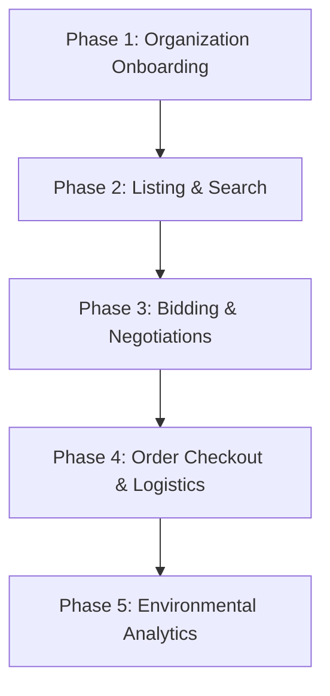

# 🔄 EcoExchange Endpoints Execution Order

This guide details the step-by-step order of execution for the B2B circular economy lifecycle endpoints in the **EcoExchange** platform, complete with actual **mock/dummy payloads** for each request.

To perform these requests quickly, import either the [Postman Collection](file:///C:/Users/kasiv/OneDrive/Desktop/ecoexchange/ecoexchange_postman_collection.json) or the native [Insomnia Collection](file:///C:/Users/kasiv/OneDrive/Desktop/ecoexchange/ecoexchange_insomnia_collection.json).

---

## 🛠️ Execution Pipeline Overview

The standard end-to-end transaction pipeline consists of 5 main phases:



---

## 🔑 Step-by-Step Endpoint Sequence with Mock Data

### Phase 1: Authentication & Organization Onboarding

Before any trading can occur, user profiles must be registered and organizations vetted by the platform administrator.

#### 1. Register Seller Organization
*   **Method / URL**: `POST /api/auth/register`
*   **Purpose**: Creates the Seller organization profile.
*   **Request Payload**:
    ```json
    {
      "name": "EcoSteel Recycling Ltd",
      "industryType": "METAL_RECYCLING",
      "gstNumber": "22AAAAA0000A1Z5",
      "city": "Boston",
      "state": "Massachusetts",
      "country": "USA",
      "contactName": "Sarah Connor",
      "email": "sarah@ecosteel.com",
      "password": "Password123!"
    }
    ```
*   **Response (200 OK / 201 Created)**:
    ```json
    {
      "id": 1,
      "name": "EcoSteel Recycling Ltd",
      "status": "PENDING"
    }
    ```

#### 2. Register Buyer Organization
*   **Method / URL**: `POST /api/auth/register`
*   **Purpose**: Creates the Buyer organization profile.
*   **Request Payload**:
    ```json
    {
      "name": "GreenBuild Construction",
      "industryType": "CONSTRUCTION",
      "gstNumber": "33BBBBB0000B2Z6",
      "city": "Chicago",
      "state": "Illinois",
      "country": "USA",
      "contactName": "John Doe",
      "email": "john@greenbuild.com",
      "password": "Password123!"
    }
    ```

#### 3. Login as Platform Admin
*   **Method / URL**: `POST /api/auth/login`
*   **Purpose**: Retrieves the admin authentication token.
*   **Request Payload**:
    ```json
    {
      "email": "platformadmin@ecoexchange.com",
      "password": "Password123!"
    }
    ```
*   **Response (200 OK)**:
    ```json
    {
      "token": "eyJhbGciOiJIUzI1NiIsInR5cCI6IkpXVCJ9.eyJzdWIiOiJwbGF0Zm9ybWFkbWluQGVjb2V4Y2hhbmdlLmNvbSIsImlhdCI6MTc4MjM2MzU5M30...",
      "email": "platformadmin@ecoexchange.com",
      "roles": ["ROLE_PLATFORM_ADMIN"]
    }
    ```
    > [!IMPORTANT]
    > Copy the returned `token` and use it as a `Bearer <token>` authorization header for the verification steps below.

#### 4. Verify Seller Organization (Admin Token Required)
*   **Method / URL**: `PUT /api/organizations/1/verify`
*   **Headers**: 
    *   `Authorization: Bearer <admin_token>`
*   **Purpose**: Approves the Seller organization, changing its status to `VERIFIED`.
*   **Response (200 OK)**:
    ```json
    {
      "id": 1,
      "name": "EcoSteel Recycling Ltd",
      "status": "VERIFIED"
    }
    ```

#### 5. Verify Buyer Organization (Admin Token Required)
*   **Method / URL**: `PUT /api/organizations/2/verify`
*   **Headers**:
    *   `Authorization: Bearer <admin_token>`
*   **Purpose**: Approves the Buyer organization, allowing it to bid on active listings.

---

### Phase 2: Marketplace Listing & Search

Once verified, the Seller lists available scrap materials and the Buyer searches the catalog.

#### 6. Login as Seller
*   **Method / URL**: `POST /api/auth/login`
*   **Purpose**: Retrieves the Seller's JWT token.
*   **Request Payload**:
    ```json
    {
      "email": "sarah@ecosteel.com",
      "password": "Password123!"
    }
    ```
*   **Response (200 OK)**:
    ```json
    {
      "token": "eyJhbGciOiJIUzI1NiIsInR5cCI6IkpXVCJ...",
      "email": "sarah@ecosteel.com",
      "roles": ["ROLE_SELLER"],
      "organizationId": 1
    }
    ```

#### 7. Create Material Listing (Seller Token Required)
*   **Method / URL**: `POST /api/listings`
*   **Headers**:
    *   `Authorization: Bearer <seller_token>`
    *   `X-Idempotency-Key: 9b1deb4d-3b7d-4bad-9bdd-2b0d7b3dcb6d` (Prevents duplicate posts)
*   **Purpose**: Publishes a new industrial scrap material offering.
*   **Request Payload**:
    ```json
    {
      "title": "Industrial Heavy Melting Steel Scrap",
      "description": "Clean steel scrap salvaged from automotive plant. High structural purity.",
      "materialCategory": "STEEL",
      "quantityTons": 25.0,
      "pricePerTon": 320.00,
      "location": "Warehouse A, Boston",
      "qualityCertificates": [
        {
          "certificateName": "ASTM E1019 Grade Validation",
          "certificateUrl": "quality-steel-cert-v4.pdf"
        }
      ]
    }
    ```
*   **Response (201 Created)**:
    ```json
    {
      "id": 1,
      "title": "Industrial Heavy Melting Steel Scrap",
      "status": "ACTIVE",
      "quantityTons": 25.0,
      "pricePerTon": 320.00
    }
    ```

#### 8. Autocomplete Search Query (Public / Buyer)
*   **Method / URL**: `GET /api/search/autocomplete?keyword=ste`
*   **Purpose**: Simulates typing in search input field.
*   **Response (200 OK)**:
    ```json
    [
      "Industrial Heavy Melting Steel Scrap"
    ]
    ```

#### 9. Query & Filter Listings (Public / Buyer)
*   **Method / URL**: `GET /api/search/listings?query=steel&category=STEEL&minPrice=200&maxPrice=500&location=Boston`
*   **Purpose**: Finds matching listings using the optimized [Search Service](file:///C:/Users/kasiv/OneDrive/Desktop/ecoexchange/search-service/src/main/java/com/industry_connect/search_service/controller/SearchController.java).
*   **Response (200 OK)**:
    ```json
    [
      {
        "id": 1,
        "title": "Industrial Heavy Melting Steel Scrap",
        "categoryName": "STEEL",
        "pricePerUnit": 320.00,
        "location": "Warehouse A, Boston",
        "status": "ACTIVE"
      }
    ]
    ```

---

### Phase 3: Bidding & Custom Negotiations

Industrial B2B contracts require direct negotiations on unit pricing and order volume.

#### 10. Login as Buyer
*   **Method / URL**: `POST /api/auth/login`
*   **Purpose**: Retrieves the Buyer's JWT token.
*   **Request Payload**:
    ```json
    {
      "email": "john@greenbuild.com",
      "password": "Password123!"
    }
    ```
*   **Response (200 OK)**:
    ```json
    {
      "token": "eyJhbGciOiJIUzI1NiIsInR5cCI6IkpXVCJ...",
      "email": "john@greenbuild.com",
      "roles": ["ROLE_BUYER"],
      "organizationId": 2
    }
    ```

#### 11. Place Custom Offer (Buyer Token Required)
*   **Method / URL**: `POST /api/listings/1/offers`
*   **Headers**:
    *   `Authorization: Bearer <buyer_token>`
    *   `X-Idempotency-Key: e2c92e10-91a1-4328-98e9-d1cf50d2bb0f`
*   **Purpose**: Submits a bid proposing a lower price and subset quantity.
*   **Request Payload**:
    ```json
    {
      "bidPricePerTon": 300.00,
      "quantityTons": 20.0,
      "message": "We would like to buy 20 tons of your steel scrap at $300 per ton."
    }
    ```
*   **Response (201 Created)**:
    ```json
    {
      "id": 1,
      "listingId": 1,
      "buyerOrgId": 2,
      "bidPricePerTon": 300.00,
      "quantityTons": 20.0,
      "status": "PENDING"
    }
    ```

#### 12. Fetch Incoming Offers (Seller Token Required)
*   **Method / URL**: `GET /api/listings/1/offers`
*   **Headers**:
    *   `Authorization: Bearer <seller_token>`
*   **Purpose**: Seller pulls all bid negotiations for their listed material scrap.

#### 13. Accept Offer (Seller Token Required)
*   **Method / URL**: `PUT /api/offers/1/accept`
*   **Headers**:
    *   `Authorization: Bearer <seller_token>`
*   **Purpose**: Accepts the bid.
*   **Response (200 OK)**:
    ```json
    {
      "id": 1,
      "status": "ACCEPTED",
      "orderId": 12,
      "shipmentId": 45
    }
    ```
    > [!NOTE]
    > Accepting this offer automatically deducts 20.0 tons from the listing (leaving 5.0 tons available), creates Order #12, and issues Shipment request #45.

---

### Phase 4: Order Checkout & Logistics Tracking

Once negotiated, the order is confirmed and shipping is tracked to delivery.

#### 14. Get Order Details (Buyer or Seller Token Required)
*   **Method / URL**: `GET /api/orders/12`
*   **Headers**:
    *   `Authorization: Bearer <seller_token>` or `Bearer <buyer_token>`
*   **Purpose**: Reviews contract, total price ($6,000), and transaction milestones.

#### 15. Assign Shipment Partner (Admin or Logistics Token Required)
*   **Method / URL**: `PUT /api/shipments/45/assign`
*   **Headers**:
    *   `Authorization: Bearer <admin_token>`
*   **Purpose**: Assigns the transit carrier partner.
*   **Request Payload**:
    ```json
    {
      "partnerId": 99
    }
    ```
*   **Response (200 OK)**:
    ```json
    {
      "id": 45,
      "partnerId": 99,
      "status": "ASSIGNED"
    }
    ```

#### 16. Pickup Cargo (Logistics Token Required)
*   **Method / URL**: `PUT /api/shipments/45/pickup`
*   **Headers**:
    *   `Authorization: Bearer <logistics_token>`
*   **Purpose**: Carrier confirms cargo is loaded on truck and transit begins.
*   **Response (200 OK)**:
    ```json
    {
      "id": 45,
      "status": "PICKED_UP"
    }
    ```

#### 17. Deliver Cargo (Logistics Token Required)
*   **Method / URL**: `PUT /api/shipments/45/deliver`
*   **Headers**:
    *   `Authorization: Bearer <logistics_token>`
*   **Purpose**: Carrier confirms successful unloading at Buyer's receiving dock.
*   **Response (200 OK)**:
    ```json
    {
      "id": 45,
      "status": "DELIVERED"
    }
    ```
    > [!TIP]
    > Delivering the shipment triggers Kafka messages that compute carbon offsets saved (reusing 20 tons of steel instead of virgin production) and increments the sustainability ledger.

---

### Phase 5: Environmental Impact Analytics & Auditing

Review calculated carbon savings and the platform-wide audit trail.

#### 18. Get Daily Analytics Metrics
*   **Method / URL**: `GET /api/analytics/metrics/daily?startDate=2026-06-01&endDate=2026-06-30`
*   **Purpose**: Fetches day-by-day aggregations of waste volumes and CO2 offsets.
*   **Response (200 OK)**:
    ```json
    [
      {
        "date": "2026-06-25",
        "tonsRecycled": 20.0,
        "co2SavedTons": 30.0,
        "totalRevenue": 6000.00
      }
    ]
    ```

#### 19. Get Summary Impact Metrics (Public Dashboard)
*   **Method / URL**: `GET /api/analytics/metrics/summary`
*   **Purpose**: Returns total accumulated metrics across all active tenants on the platform.
*   **Response (200 OK)**:
    ```json
    {
      "totalTonsRecycled": 1420.5,
      "totalCo2SavedTons": 2130.75,
      "activeOrganizations": 52,
      "totalTransactionsCount": 184
    }
    ```

#### 20. View Audit Trail (Admin Token Required)
*   **Method / URL**: `GET /api/analytics/audits?service=marketplace-service&action=LISTING_CREATED`
*   **Headers**:
    *   `Authorization: Bearer <admin_token>`
*   **Purpose**: Admin inspects full compliance tracking audit history.
*   **Response (200 OK)**:
    ```json
    [
      {
        "id": 234,
        "timestamp": "2026-06-25T10:44:00",
        "service": "marketplace-service",
        "action": "LISTING_CREATED",
        "userId": "sarah@ecosteel.com",
        "description": "Listing ID 1 created by organization ID 1"
      }
    ]
    ```
