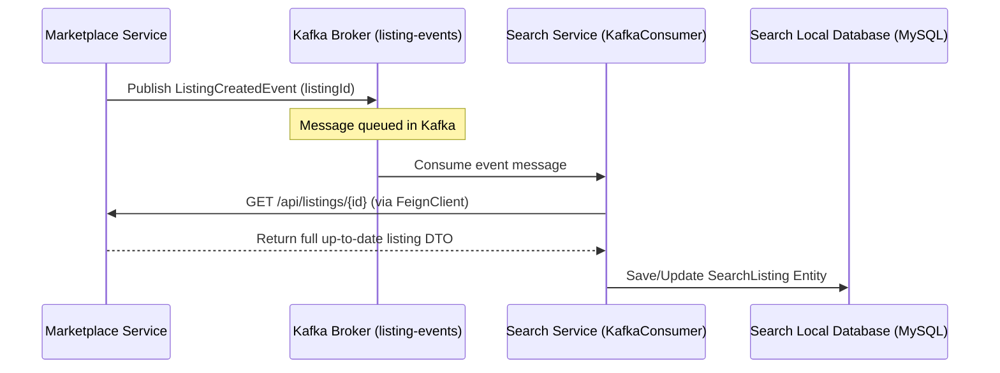

# 🔍 EcoExchange Search Service Overview & Architecture

Welcome to the documentation for the **EcoExchange Search Service**. This service is a dedicated microservice within the EcoExchange platform, built specifically to provide high-speed listing searches, advanced filtering, and instant title autocompletion suggestions.

For the high-level platform context, please refer to the main [Project Overview](file:///C:/Users/kasiv/OneDrive/Desktop/ecoexchange/docs/project-overview.md).

---

## 🛠️ Technology Stack

The search service is designed as an independent, lightweight Java microservice utilizing:

*   **Runtime & Framework**: **Java 25** and **Spring Boot 4.1.0** (offering modern language features and virtual threads support).
*   **Database Integration**: **Spring Data JPA** with **Hibernate** mapping to a local MySQL instance.
*   **Asynchronous Processing**: **Apache Kafka** (via spring-kafka) to listen to listing updates and offer changes.
*   **Service Communication**: **Spring Cloud OpenFeign** to fetch details from other services synchronously during indexing.
*   **Registry & Configuration**: **Eureka Client** (for dynamic registration) and **Spring Cloud Config Client** (for central configuration management).
*   **Security**: **Spring Security** combined with **JWT** filter validation to verify incoming HTTP requests.

---

## 🏗️ Architectural Patterns & Design Decisions

### 1. CQRS (Command Query Responsibility Segregation)
To maintain high responsiveness and prevent read queries from impacting transactional performance:
*   Write-heavy operations (creating listings, updating stocks, and submitting bids) are handled by the [Marketplace Service](file:///C:/Users/kasiv/OneDrive/Desktop/ecoexchange/marketplace-service).
*   The [Search Service](file:///C:/Users/kasiv/OneDrive/Desktop/ecoexchange/search-service) maintains a denormalized, read-optimized database table [SearchListing](file:///C:/Users/kasiv/OneDrive/Desktop/ecoexchange/search-service/src/main/java/com/industry_connect/search_service/entity/SearchListing.java) dedicated entirely to answering user searches under 100ms.

### 2. Event-Driven Asynchronous Synchronization
The Search Service keeps its local database in sync with the write repository by subscribing to Kafka topics:

*   **Event Listeners**: Inside [KafkaConsumer.java](file:///C:/Users/kasiv/OneDrive/Desktop/ecoexchange/search-service/src/main/java/com/industry_connect/search_service/service/KafkaConsumer.java), `@KafkaListener` annotations subscribe to `listing-events` and `offer-events`.
*   **Feign Fetch**: Upon receiving an event, the consumer extracts the listing ID and invokes [MarketplaceFeignClient](file:///C:/Users/kasiv/OneDrive/Desktop/ecoexchange/search-service/src/main/java/com/industry_connect/search_service/client/MarketplaceFeignClient.java) to pull the complete up-to-date representation.
*   **Fallback Status**: If a listing can no longer be retrieved from the Marketplace Service (e.g. it was permanently deleted), the consumer marks the local record status as `DELETED` to exclude it from searches.

---

## 📂 Codebase Walkthrough

The Search Service is organized into clean layers:

1.  **Controller**: [SearchController.java](file:///C:/Users/kasiv/OneDrive/Desktop/ecoexchange/search-service/src/main/java/com/industry_connect/search_service/controller/SearchController.java)
    *   Exposes endpoints to the [API Gateway](file:///C:/Users/kasiv/OneDrive/Desktop/ecoexchange/apigateway) under the `/api/search` namespace.
2.  **Service**: [SearchService.java](file:///C:/Users/kasiv/OneDrive/Desktop/ecoexchange/search-service/src/main/java/com/industry_connect/search_service/service/SearchService.java)
    *   Implements the core business search logic, formats queries, handles default search parameters (such as filtering by `ACTIVE` status by default), and sanitizes keywords.
3.  **Repository**: [SearchListingRepository.java](file:///C:/Users/kasiv/OneDrive/Desktop/ecoexchange/search-service/src/main/java/com/industry_connect/search_service/repository/SearchListingRepository.java)
    *   Implements native custom JPQL queries using `LIKE` pattern matching to perform multi-criteria searches across title, description, category, price range, and location.
4.  **Security Configuration**: [SecurityConfig.java](file:///C:/Users/kasiv/OneDrive/Desktop/ecoexchange/search-service/src/main/java/com/industry_connect/search_service/config/SecurityConfig.java)
    *   Configures public access for search operations while locking down internal/administrative updates. Integrates the [JwtAuthenticationFilter](file:///C:/Users/kasiv/OneDrive/Desktop/ecoexchange/search-service/src/main/java/com/industry_connect/search_service/config/JwtAuthenticationFilter.java).

---

## 🔌 API Contract Reference

The service provides three core REST endpoints:

### 1. Execute Search Filter
*   **Endpoint**: `GET /api/search`
*   **Description**: Queries listings matching search criteria.
*   **Parameters**:
    *   `keyword` (String, optional): Matches text in title, description, or category name.
    *   `categoryId` (Long, optional): Filters listings under a specific waste stream.
    *   `minPrice` (Double, optional): Minimum price threshold.
    *   `maxPrice` (Double, optional): Maximum price threshold.
    *   `location` (String, optional): Filters listings by country/state/city.
    *   `status` (String, optional): Filters listings by status (e.g. `ACTIVE`, `SOLD`, defaults to `ACTIVE`).

### 2. Title Autocomplete
*   **Endpoint**: `GET /api/search/autocomplete`
*   **Description**: Generates instant, unique suggestions for matching listing titles as the user types.
*   **Parameters**:
    *   `keyword` (String, required): Current letters typed in search box.

### 3. Extract Categories
*   **Endpoint**: `GET /api/search/categories`
*   **Description**: Pulls a unique list of category DTOs (`id` and `name`) that currently contain active listings, driving the marketplace filters dynamically.

---

## 🔮 Future Vision & Roadmap

While the SQL-based `LIKE` matching in the denormalized MySQL database is fast and reliable for current volumes, we plan the following upgrades as transaction volume scales:

1.  **Elasticsearch Migration**:
    *   Transition the search repository indexing backend to a true **Elasticsearch cluster**.
    *   Enables fuzzy matching (handling buyer typos), phonetic searches, and multi-lingual processing.
2.  **Redis Cache Integration**:
    *   Deploy **Redis** cache stores for high-frequency queries (such as autocomplete prefixes or category summaries) to guarantee sub-10ms response times.
3.  **Geospatial Distance Queries**:
    *   Store geographic coordinates (latitude and longitude) of listings.
    *   Enable buyers to query "listings within a 100-mile radius" of their manufacturing plants to estimate logistics freight rates directly from the search screen.
