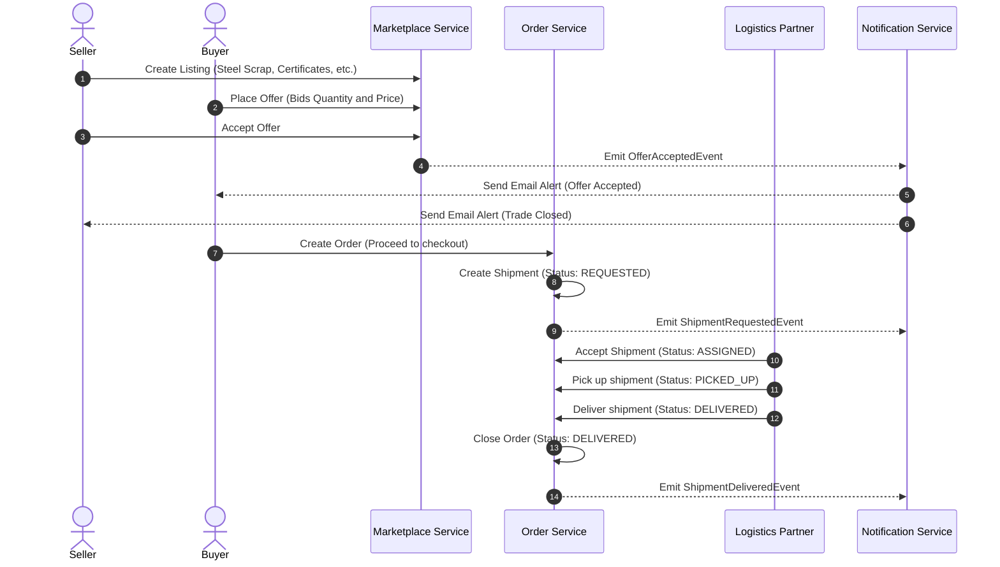

# Trading and Logistics Flow: Buyer-Seller Transactions & Logistics Lifecycle

This document explains both high-level and low-level workflows of the trading, negotiation, notification, and shipment lifecycle within the **EcoExchange** platform.

For a broader perspective on the system architecture, refer to the [Project Overview](file:///C:/Users/nikhi/Desktop/ExoExchange/Eco-exchange/docs/project-overview.md).

---

## 1. High-Level Process Overview



---

## 2. Detailed Workflows (Low-Level Mechanics)

### A. How a Seller Sells
1. **Creation**: A Seller initiates the listing of industrial byproducts via `POST /api/listings`. They define listing properties (materials category, total quantity, unit price, location) and upload quality certificates (representing laboratory assays, etc.) and images.
2. **Publishing**: The [Marketplace Service](file:///C:/Users/nikhi/Desktop/ExoExchange/Eco-exchange/marketplace-service) persists the metadata to MySQL and invokes [KafkaEventPublisher](file:///C:/Users/nikhi/Desktop/ExoExchange/Eco-exchange/marketplace-service/src/main/java/com/industry_connect/marketplace_service/service/KafkaEventPublisher.java) to publish a `ListingCreatedEvent` to the `listing-events` Kafka topic.
3. **Index Update**: The [Search Service](file:///C:/Users/nikhi/Desktop/ExoExchange/Eco-exchange/search-service) consumes this event and updates its local read-optimized tables to make the listing discoverable in search queries.

### B. How a Buyer Buys (Offer & Negotiation)
1. **Search**: A Buyer browses listings using search keywords, category filters, price ranges, and locations via `GET /api/search`.
2. **Bidding/Placing an Offer**: Instead of a simple "buy now" checkout, industrial transactions often require custom negotiations. The Buyer initiates a bid by sending a `POST /api/listings/{id}/offers` request, proposing:
   - The specific quantity they wish to purchase.
   - The offered price per unit.
3. **Offer Recording**: The [Marketplace Service](file:///C:/Users/nikhi/Desktop/ExoExchange/Eco-exchange/marketplace-service) validates that the quantity does not exceed the available inventory. It creates an `Offer` record (status set to `PENDING`) and emits an `OfferPlacedEvent` to the `offer-events` topic.
4. **Offer Acceptance**: The Seller reviews the offer. To close the deal, the Seller triggers `PUT /api/offers/{id}/accept`.
   - The [Marketplace Service](file:///C:/Users/nikhi/Desktop/ExoExchange/Eco-exchange/marketplace-service/src/main/java/com/industry_connect/marketplace_service/service/MarketplaceService.java#L256) checks that the listing is still active.
   - It updates the offer status to `ACCEPTED`.
   - It reduces the listing's `availableQuantity`.
   - It publishes an `OfferAcceptedEvent` via [KafkaEventPublisher](file:///C:/Users/nikhi/Desktop/ExoExchange/Eco-exchange/marketplace-service/src/main/java/com/industry_connect/marketplace_service/service/KafkaEventPublisher.java#L33) to the `offer-events` Kafka topic.

### C. Email Notifications Flow
Upon acceptance of an offer, asynchronous notifications alert both parties:
- **How it triggers**: The [Notification Service](file:///C:/Users/nikhi/Desktop/ExoExchange/Eco-exchange/notification-service) consumes the event.
- **Who gets notified**:
  - **Buyer Notification**: An email is dispatched notifying them that the Seller accepted their bid, instructing them to proceed to checkout and arrange payment/delivery terms.
  - **Seller Notification**: An email is sent confirming that their listing has successfully secured an agreement and that a corresponding shipping/order tracking run is being generated.
- **Low-Level execution**: The consumer publishes a `NotificationRequestedEvent` containing the recipient emails, subject, and text to the `notification-events` topic. This message is processed by mail templates that connect to external SMTP servers to send the physical emails.

### D. Order Creation
1. **API Trigger**: Once the offer is accepted, a client sends a `POST /api/orders` request to the [Order Service](file:///C:/Users/nikhi/Desktop/ExoExchange/Eco-exchange/order-service).
2. **Persistence**: The [OrderService](file:///C:/Users/nikhi/Desktop/ExoExchange/Eco-exchange/order-service/src/main/java/com/industry_connect/order_service/service/OrderService.java#L23) creates a new `Order` (associated with the `listingId`, `buyerOrgId`, `sellerOrgId`, `offerId`, and `totalAmount`) under the initial status of `PENDING`.
3. **Kafka Event**: The service invokes [EventPublisher](file:///C:/Users/nikhi/Desktop/ExoExchange/Eco-exchange/order-service/src/main/java/com/industry_connect/order_service/service/EventPublisher.java#L20) to publish an `OrderCreatedEvent` to the `order-events` Kafka topic.

---

## 3. Logistics Partner Workflows & Shipment Events

The logistics workflow manages the physical movement of heavy industrial waste from the seller's production facility to the buyer's factory.

### A. Step-by-Step Shipment Lifecycle

```
[Order Created]
       ↓
1. createShipment() ──→ (Status: REQUESTED) ──→ Emit ShipmentRequestedEvent
       ↓
2. assignShipment() ──→ (Status: ASSIGNED)
       ↓
3. pickupShipment() ──→ (Status: PICKED_UP)
       ↓
4. deliverShipment() ──→ (Status: DELIVERED) ──→ Emit ShipmentDeliveredEvent
       ↓
[Order status set to DELIVERED]
```

### B. High-Level and Low-Level Lifecycle States

#### 1. Shipment Initialization (`REQUESTED`)
- **Action**: When an order is finalized, a shipment is initiated using `POST /api/orders/{orderId}/shipment`.
- **Low-Level Java Logic**: Inside [ShipmentService](file:///C:/Users/nikhi/Desktop/ExoExchange/Eco-exchange/order-service/src/main/java/com/industry_connect/order_service/service/ShipmentService.java#L27):
  - The service verifies that the order exists and that no duplicate shipment has already been created.
  - If a carrier is not yet specified, the status is initialized to `REQUESTED`.
  - The parent order status is updated to `SHIPPED`.
  - An event is published via [EventPublisher.publishShipmentRequested()](file:///C:/Users/nikhi/Desktop/ExoExchange/Eco-exchange/order-service/src/main/java/com/industry_connect/order_service/service/EventPublisher.java#L26) to the `shipment-events` Kafka topic.

#### 2. Carrier Assignment (`ASSIGNED`)
- **Action**: A logistics partner is assigned to transport the load via `PUT /api/shipments/{id}/assign`.
- **Low-Level Java Logic**: Inside [ShipmentService.assignShipment()](file:///C:/Users/nikhi/Desktop/ExoExchange/Eco-exchange/order-service/src/main/java/com/industry_connect/order_service/service/ShipmentService.java#L61), the system:
  - Validates the shipment ID.
  - Binds the `partnerId` (Logistics Partner ID) to the shipment record.
  - Updates the shipment status to `ASSIGNED`.

#### 3. Cargo Picked Up (`PICKED_UP`)
- **Action**: The carrier arrives at the Seller's site, verifies the cargo, loads the transport vehicle, and triggers `PUT /api/shipments/{id}/pickup`.
- **Low-Level Java Logic**: Inside [ShipmentService.pickupShipment()](file:///C:/Users/nikhi/Desktop/ExoExchange/Eco-exchange/order-service/src/main/java/com/industry_connect/order_service/service/ShipmentService.java#L76), the shipment's status is transitioned to `PICKED_UP`. This tells both buyer and seller that the materials are currently in transit.

#### 4. Cargo Delivered & Order Closed (`DELIVERED`)
- **Action**: The carrier reaches the Buyer's receiving location, unloads the waste material, obtains physical signatures, and triggers `PUT /api/shipments/{id}/deliver`.
- **Low-Level Java Logic**: Inside [ShipmentService.deliverShipment()](file:///C:/Users/nikhi/Desktop/ExoExchange/Eco-exchange/order-service/src/main/java/com/industry_connect/order_service/service/ShipmentService.java#L85), the system:
  - Updates the shipment status to `DELIVERED`.
  - Retrieves the parent order and changes its status from `SHIPPED` to `DELIVERED`.
  - Publishes a `ShipmentDeliveredEvent` via [EventPublisher.publishShipmentDelivered()](file:///C:/Users/nikhi/Desktop/ExoExchange/Eco-exchange/order-service/src/main/java/com/industry_connect/order_service/service/EventPublisher.java#L32) to the `shipment-events` Kafka topic.
  - **Downstream Consumer**: The [Analytics Service](file:///C:/Users/nikhi/Desktop/ExoExchange/Eco-exchange/analytics-service) consumes this event, aggregates the tonnage of material recycled, calculates carbon offset statistics (CO2 saved), and records the revenue.
